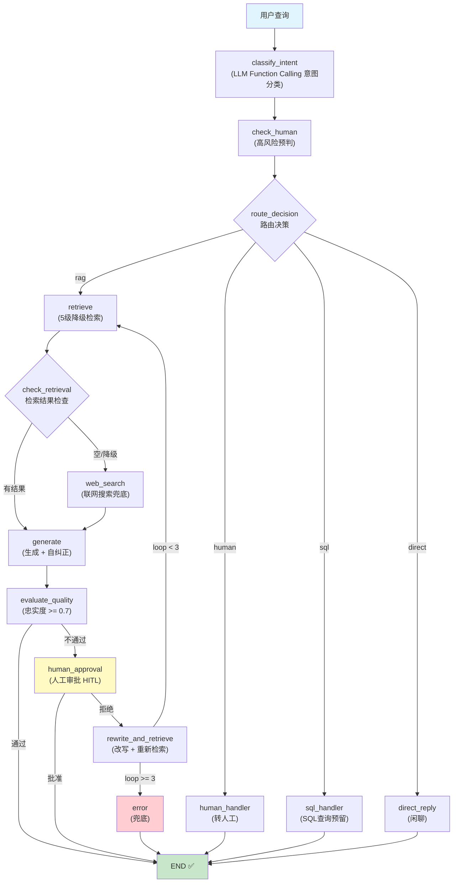

# 🤖 Agentic RAG 电商智能客服系统

<p align="center"><b>E-commerce Customer Service System</b></p>

> 基于 LangGraph 12 节点编排的 Agentic RAG 系统 — 混合检索、5 级降级、幻觉检测自纠正、Human-in-the-Loop

[](https://www.python.org/)
[](https://fastapi.tiangolo.com/)
[](https://milvus.io/)
[](https://langchain-ai.github.io/langgraph/)
[](LICENSE)

---

## 📸 Demo

<p align="center">
  
  
</p>
<p align="center">
  
  
</p>

> 访问地址：聊天 `:7861` · 入库 `:7860` · 管理员 `:7862` · API 文档 `:8000/docs`

---

## ✨ 功能全景

### 🔍 检索系统 (5 级级联)

| 功能 | 说明 | 状态 |
|------|------|------|
| Hybrid Search | BM25 稀疏(0.3) + Dense 稠密(0.7) + WeightedRanker 融合 | ✅ |
| Reranker 精排 | qwen3-vl-rerank，初始 20 候选 → 精排 Top-5 | ✅ |
| 查询改写 (L2) | LLM 改写模糊 query，最多 2 次 | ✅ |
| 查询扩展 (L3) | Multi-Query 多角度扩展 + HyDE 假设文档嵌入，并行检索 | ✅ |
| 联网搜索 (L4) | 智谱 GLM-4-Flash 优先，Tavily Search 备选 | ✅ |
| 诚实兜底 (L5) | "根据已有信息无法确认，建议咨询人工客服" | ✅ |
| 意图路由 | LLM Function Calling，6 类意图 (rag/sql/human/direct/hybrid) | ✅ |

### 🧠 生成质量

| 功能 | 说明 | 状态 |
|------|------|------|
| 幻觉检测 | G-Eval 风格，逐条事实断言检查 (supported/partial/hallucination) | ✅ |
| 自纠正闭环 | 最多 2 轮：检测 → 提取缺失信息 → 改写重搜 → 重新生成 | ✅ |
| 忠实度评分 | 每个回答附带 faithfulness 分数 | ✅ |
| LLM 调用预算 | 单次请求最多 8 次 LLM 调用，防止延迟爆炸 | ✅ |

### 🎯 LangGraph 编排

| 功能 | 说明 | 状态 |
|------|------|------|
| 12 节点 StateGraph | classify→check_human→retrieve→generate→evaluate→human_approval→rewrite | ✅ |
| Agentic 回路 | evaluate → human_approval → rewrite → retrieve → generate (最多 3 轮) | ✅ |
| Human-in-the-Loop | LangGraph `interrupt_before` 真正中断，外部注入审批结果 | ✅ |
| 4 条件边 | route_decision / check_retrieval / evaluate_decision / human_decision_edge | ✅ |
| 级联检索可视化 | retrieve 和 web_search 是独立图节点，流程可观测 | ✅ |

### 🛡️ 安全防御 (4 层)

| 层级 | 说明 | 状态 |
|------|------|------|
| 输入清洗 | 检测 Prompt 注入攻击，过滤恶意输入 | ✅ |
| 角色锚定 | System Prompt 加固，防止越狱 | ✅ |
| 文档过滤 | 入库前检查恶意内容 | ✅ |
| 输出护栏 | 防止系统提示词泄露 | ✅ |

### 📊 评估体系

| 指标 | 实现方式 | 状态 |
|------|----------|------|
| Recall@5 | Embedding 余弦相似度 (阈值 0.7)，降级为子串匹配 | ✅ |
| MRR | Embedding 相似度排名，降级为子串匹配 | ✅ |
| Faithfulness | LLM G-Eval 精确模式 → Embedding 快速模式 → 单词重叠率兜底 | ✅ |
| Keyword Coverage | 字符串匹配 | ✅ |
| Latency Score | 延迟归一化 (越快越高) | ✅ |
| 完整 RAG 评估 | `with_generation=True` 走检索+生成全链路 | ✅ |

### 🔧 工程基础设施

| 功能 | 说明 | 状态 |
|------|------|------|
| LLMClient 统一调用 | 同步 httpx.Client + 异步 httpx.AsyncClient，自动重试+降级 | ✅ |
| 三层缓存 | Query 缓存 (TTL 3600s) + Embedding 缓存 + LLM 响应缓存 | ✅ |
| 结构化日志 | Python logging，日志轮转 30 天 | ✅ |
| 成本监控 | 每日统计 (请求量/费用/模型分布)、P99 延迟、告警阈值 | ✅ |
| 生产级错误处理 | 重试策略 + 降级 + 兜底，LLM API 不可用时自动 fallback | ✅ |
| 线程安全单例 | @singleton_factory 双重检查锁定，21 个模块单例 | ✅ |
| 速率限制 | Embedding API 120 RPM 线程安全限制器 | ✅ |

### 🌐 流式与多轮对话

| 功能 | 说明 | 状态 |
|------|------|------|
| SSE 流式输出 | asyncio.to_thread 非阻塞检索 + 逐 token 返回 | ✅ |
| 多轮对话 | SQLite 会话管理，滑动窗口 (6 条) | ✅ |
| 智能重检索 | 多轮对话时判断追问/切换/澄清，避免重复检索 | ✅ |
| 人工介入机制 | 4 类场景 (退款/投诉/法律/低置信度) + 优先级管理 | ✅ |

### 📥 数据摄入

| 功能 | 说明 | 状态 |
|------|------|------|
| PDF 解析 | 多线程并发 OCR (8 线程)，4 模型自动切换 | ✅ |
| Office 文档 | Word(.docx) / Excel(.xlsx) / PPT(.pptx) | ✅ |
| 图片解析 | VLM 生成文字描述，支持商品图片 | ✅ |
| FAQ JSON | 结构化问答对导入 | ✅ |
| 网页抓取 | URL 内容提取 | ✅ |
| 纯文本 | TXT / Markdown | ✅ |
| 文件防御 | 上传预检 (类型/大小/格式) + 质量检查 | ✅ |

### ✂️ 智能分块

| 策略 | 适用场景 | 状态 |
|------|----------|------|
| Markdown 分块 | 标题层级感知切分 | ✅ |
| FAQ 分块 | Q&A 问答对识别 | ✅ |
| 语义分块 | Embedding 相似度边界切分 | ✅ |
| 递归分块 | 固定长度 + 重叠，兜底策略 | ✅ |
| 分块路由 | 根据文档类型自动选择策略 | ✅ |
| 分块实验 | 4 策略 ablation study 对比 | ✅ |

### 🗂️ 管理面板 (3 套 UI)

| 面板 | 端口 | 功能 | 状态 |
|------|------|------|------|
| 知识库入库 | 7860 | 多格式上传 → 解析预览(分页/Sheet/QA) → 一键存入 Milvus，自动去重 | ✅ |
| 用户聊天 | 7861 | 流式对话 + 意图显示 + 来源追踪 + HITL 自动保存 + 重试上一条 | ✅ |
| 管理员 | 7862 | HITL 工单管理(待处理队列/分配/解决) + 系统监控(健康/缓存/统计) + 历史记录 | ✅ |

### 🚢 部署

| 功能 | 说明 | 状态 |
|------|------|------|
| Docker Compose | 5 服务编排 (api/gradio/chat-ui/admin-ui/redis) | ✅ |
| 健康检查 | 所有服务健康探针 + /api/health 端点 | ✅ |
| 依赖管理 | pip + requirements.txt，国内镜像加速 | ✅ |
| 配置中心 | pydantic-settings，.env 文件注入 | ✅ |

---

## 🏗️ 系统架构



### 检索降级流程

```
Level 1: 原始查询 → Hybrid Search (BM25 + Dense)
Level 2: LLM 改写查询 → 重新检索 (最多 2 次)
Level 3: Multi-Query + HyDE → 并行检索
Level 4: 联网搜索（智谱 / Tavily）
Level 5: 诚实兜底
```

---

## 🚀 快速开始

### 环境要求

- Python 3.12+
- Docker & Docker Compose
- 8GB+ RAM
- API Key：[阿里云百炼](https://bailian.console.aliyun.com/) + [DeepSeek](https://platform.deepseek.com/)

### 1. 克隆 & 配置

```bash
git clone https://github.com/<xiaoming>/rag-ecommerce-customer-service.git
cd rag-ecommerce-customer-service
cp .env.example .env
# 编辑 .env 填入 API Key
```

### 2. 启动

```bash
docker compose -f docker-compose-milvus.yml up -d   # Milvus
docker compose -f docker-compose-rag.yml up -d --build   # RAG 服务
```

### 3. 访问

| 服务 | 地址 | 说明 |
|------|------|------|
| API 文档 | http://localhost:8000/docs | Swagger UI |
| 知识库入库 | http://localhost:7860 | 文档上传解析 |
| 用户聊天 | http://localhost:7861 | 客服对话 |
| 管理员控制台 | http://localhost:7862 | 人工介入管理 |

---

## 📁 项目结构

```
src/
├── ingestion/       # 多格式摄入 (PDF/Word/Excel/PPT/Image/JSON/web/TXT)
├── chunking/        # 4 种分块策略 (Markdown/FAQ/Semantic/Recursive) + 路由 + 实验
├── embedding/       # Embedder + Milvus store + Retriever + 5级降级 + 查询扩展
├── routing/         # LLM Function Calling 意图分类 (6类) + 路由
├── retrieval/       # Cross-Encoder Reranker 重排序
├── generation/      # G-Eval 幻觉检测 + 自纠正闭环 (LLM 调用预算)
├── conversation/    # SSE 流式 + 会话管理 + 智能重检索 + 人工介入
├── engineering/     # 缓存/监控/日志/错误处理/安全/统一 LLMClient/单例
├── evaluation/      # 评估器 + 5 指标 (LLM G-Eval / Embedding 双模式)
├── graph/           # LangGraph 12 节点 StateGraph + 4 条件边 + HITL
├── api/             # FastAPI + 路由 (query/chat/stream/upload/evaluate/stats)
├── admin/           # Gradio UI ×3 (入库/聊天/管理员)
└── config.py        # pydantic-settings 配置中心
```

---

## 🐳 Docker 服务

| 服务 | 端口 | 说明 |
|------|------|------|
| rag-redis | 6379 | 三层缓存 |
| rag-api | 8000 | FastAPI 主服务 |
| rag-gradio | 7860 | 知识库入库平台 |
| rag-chat-ui | 7861 | 用户聊天界面 |
| rag-admin-ui | 7862 | 管理员控制台 |

---

## ⚙️ 配置

```bash
# LLM
DEFAULT_MODEL=deepseek-chat
FALLBACK_MODEL=qwen-plus

# Embedding
EMBEDDING_MODEL=qwen3-vl-embedding
EMBEDDING_DIM=2048

# Reranker
RERANKER_MODEL=qwen3-vl-rerank

# OCR (4 模型自动切换)
OCR_MODEL=qwen-vl-ocr-2025-04-13
OCR_MODEL_FALLBACK=qwen-vl-ocr-2025-08-28,qwen-vl-ocr-2025-11-20,qwen3.5-ocr

# 检索
RETRIEVAL_TOP_K=5
RETRIEVAL_SIMILARITY_THRESHOLD=0.7

# 缓存
QUERY_CACHE_TTL=3600

# 幻觉
MAX_CORRECTION_ROUNDS=2
FAITHFULNESS_THRESHOLD=0.8
```

---

## 🗺️ Roadmap

- [x] Hybrid Search (BM25 + Dense, 0.3/0.7 权重)
- [x] 5 级降级检索 (改写→扩展→联网→兜底)
- [x] Multi-Query + HyDE
- [x] Reranker 重排序
- [x] 6 类意图路由 (LLM Function Calling)
- [x] 幻觉检测 (G-Eval) + 自纠正闭环
- [x] Human-in-the-Loop (LangGraph interrupt_before)
- [x] SSE 流式输出
- [x] 3 套 Gradio UI (入库/聊天/管理)
- [x] 4 种分块策略 + 自动路由
- [x] 多格式摄入 (8 种格式)
- [x] 评估系统 (5 指标 + 双模式)
- [x] 4 层安全防御
- [x] 三层缓存 + 成本监控 + 结构化日志
- [x] LLMClient 统一调用 (重试+降级)
- [x] 线程安全单例 (21 个模块)
- [x] Docker Compose 一键部署
- [x] OCR 4 模型自动切换
- [ ] RAGAS 评估集成
- [ ] Graph RAG (知识图谱)
- [ ] 多模态检索 (图片+文本)
- [ ] 语义缓存 (GPTCache)
- [ ] Kubernetes 部署

---

## 🤝 技术选型

| 技术 | 选择原因 |
|------|----------|
| **Milvus** | 原生 BM25 + Dense 混合检索、jieba 中文分词、开源免费 |
| **LangGraph** | 图结构可视化、TypedDict State 管理、HITL 原生支持 |
| **qwen3-vl-embedding** | 多模态(文本+图片)同一向量空间、中文优化、2048-dim |
| **DeepSeek** | 中文能力强、Function Calling、成本比 GPT-4 低 |
| **FastAPI** | async 原生、自动 Swagger、高性能 |
| **Gradio** | Python 原生 UI，快速构建和管理 |

---

## 📄 License

MIT — 详见 [LICENSE](LICENSE)
