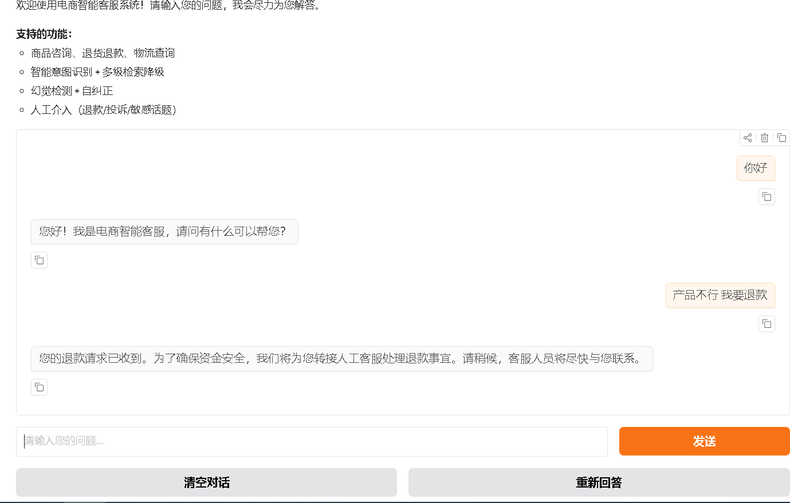
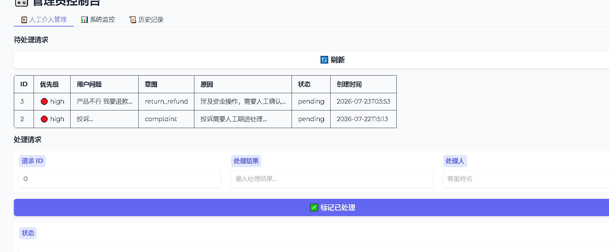
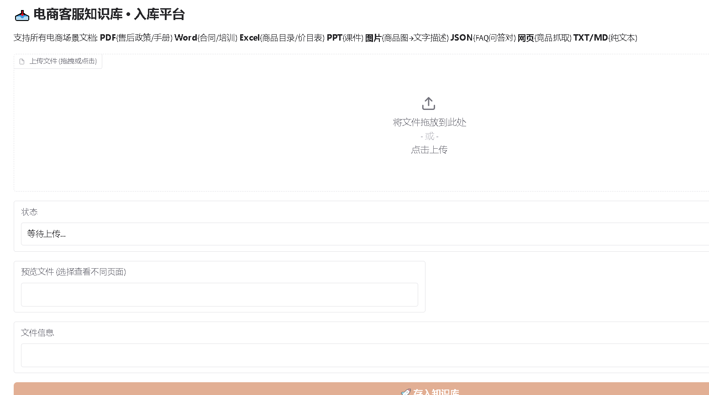
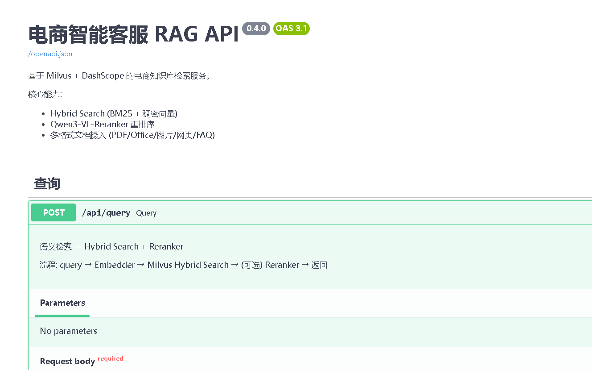
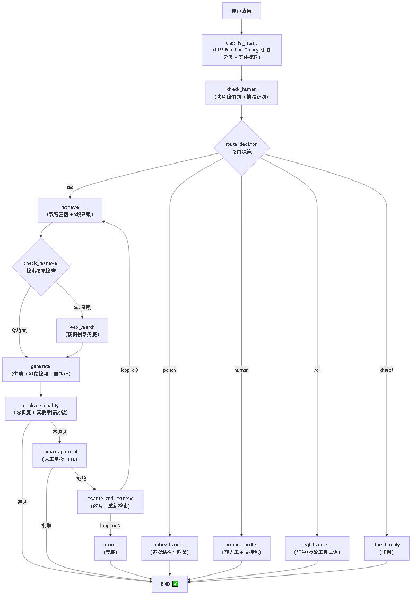

# 🤖 Agentic RAG 电商智能客服系统

<p align="center"><b>E-commerce Customer Service System</b></p>

> 基于 LangGraph 13 节点编排的 Agentic RAG 系统 — 混合检索、5 级降级、幻觉检测自纠正、Human-in-the-Loop、三层记忆、业务工具调用

[](https://www.python.org/)
[](https://fastapi.tiangolo.com/)
[](https://milvus.io/)
[](https://langchain-ai.github.io/langgraph/)
[](LICENSE)

---

## 📊 评测指标（49 条客服问答 · 6 意图 × 3 难度）

| 指标 | 数值 | 说明 |
|------|------|------|
| **Recall@5** | **0.755** | 检索召回率 |
| **MRR** | **0.725** | 排序质量 |
| **NDCG@5** | **0.728** | 整体排序 |
| **Faithfulness** | **0.72** | 完整 RAG 生成忠实度 |
| 关键词覆盖率 | 0.976 | 命中关键词 |

> 一键复现：`python scripts/run_benchmark.py --with-generation`（报告存 `reports/benchmark_*.json`）

---

## 📸 Demo

<p align="center">
  
  
</p>
<p align="center">
  
  
</p>

> 访问地址：聊天 `:7861` · 入库 `:7860` · 管理员 `:7862` · API 文档 `:8000/docs`

---

## ✨ 功能全景

### 🔍 检索系统（双路召回 + 5 级级联）

| 功能 | 说明 | 状态 |
|------|------|------|
| Hybrid Search | BM25 稀疏(0.3) + Dense 稠密(0.7) + WeightedRanker 融合 | ✅ |
| **双路召回** | 原始问题 + 改写问题并行检索 → 合并去重 → 精排（召回 +30%） | ✅ |
| **复杂查询分解** | 检测"和/对比/区别"→ 拆子问题并行检索汇总 | ✅ |
| Reranker 精排 | qwen3-vl-rerank，初始 20 候选 → 精排 Top-5 | ✅ |
| 查询改写 (L2) | LLM 改写模糊 query，最多 2 次 | ✅ |
| 查询扩展 (L3) | Multi-Query 多角度扩展 + HyDE 假设文档嵌入，并行检索 | ✅ |
| 联网搜索 (L4) | 智谱 GLM-4-Flash 优先，Tavily Search 备选 | ✅ |
| 诚实兜底 (L5) | "根据已有信息无法确认，建议咨询人工客服" | ✅ |
| 意图路由 | LLM Function Calling，6 类意图 + 工具/政策子路由 | ✅ |

### 🧠 生成质量（幻觉检测 + 高敏护栏）

| 功能 | 说明 | 状态 |
|------|------|------|
| 幻觉检测 | G-Eval 风格，**claims 级聚合**（不信 LLM 自报标量），逐条断言检查 | ✅ |
| 自纠正闭环 | 最多 2 轮：检测 → 提取缺失信息 → 改写重搜 → 重新生成 | ✅ |
| **高敏承诺护栏** | 价格/退款/政策承诺需忠实度 ≥0.85，不达标转人工核验 | ✅ |
| 忠实度评分 | 每个回答附带 faithfulness 分数 | ✅ |
| LLM 调用预算 | 单次请求最多 8 次 LLM 调用，防止延迟爆炸 | ✅ |

### 💼 业务工具（RAG + 工具 + 转人工）

| 功能 | 说明 | 状态 |
|------|------|------|
| **订单/物流查询** | 检测订单号/快递单号 → 查真实 MySQL（copilot 库 30万订单 + 24.6万轨迹），MySQL 不可达自动降级 mock | ✅ |

> 📌 订单/物流数据：copilot MySQL（本项目 `data/db/` 管理，只读账号 `agent_ro`）。
> 演示单号：`ORD000000001`（已签收，韵达 `YD000000638365`）/ 物流轨迹 `SF1234567890`。
> 建库/重建：`data/db/copilot_init.sql` + `seed_orders.py` + `seed_tracking.py`。配置见 `src/config.py` §订单数据库。
| **退货结构化政策** | 退货窗口/运费/时效/质量争议 子场景路由，零幻觉回答 | ✅ |
| **转人工交接包** | 摘要+实体+情绪+已尝试动作，客服拿包直接接手 | ✅ |
| **同窗口人工对话** | 转人工后客户消息进人工，客服回复主动推回（gr.Timer 轮询） | ✅ |

### 🧠 三层会话记忆

| 层 | 说明 | 状态 |
|------|------|------|
| 短期窗口 | 最近 6 轮原文保留 | ✅ |
| 滚动摘要 | 窗口外旧对话 LLM 压缩（实体感知） | ✅ |
| **实体 ledger** | 券/订单/金额 每轮抽取，"上次那个券"靠实体表解析 | ✅ |
| 指代消解护栏 | 分类为 chitchat 但含指代词 → 强制走 RAG | ✅ |

### 🎯 LangGraph 编排

| 功能 | 说明 | 状态 |
|------|------|------|
| 13 节点 StateGraph | classify→check_human→retrieve→generate→evaluate→human_approval→rewrite + policy | ✅ |
| Agentic 回路 | evaluate → human_approval → rewrite → retrieve → generate (最多 3 轮) | ✅ |
| Human-in-the-Loop | LangGraph `interrupt_before` 真正中断，外部注入审批结果 | ✅ |
| 级联检索可视化 | retrieve 和 web_search 是独立图节点，流程可观测 | ✅ |
| **政策时效** | effective_from/to 生效窗口，检索自动过滤过期 + 写入后缓存失效 | ✅ |

### 🛡️ 安全防御（4 层 + PII）

| 层级 | 说明 | 状态 |
|------|------|------|
| 输入清洗 | 检测 Prompt 注入攻击，过滤恶意输入 | ✅ |
| **PII 脱敏** | 手机号/身份证/银行卡 7 类正则自动替换 | ✅ |
| 角色锚定 | System Prompt 加固，防止越狱 | ✅ |
| 文档过滤 | 入库前检查恶意内容 | ✅ |
| 输出护栏 | 防止系统提示词泄露 | ✅ |

### 📊 评估体系

| 指标 | 实现方式 | 状态 |
|------|----------|------|
| Recall@5 / Precision@5 | Embedding 余弦相似度 (阈值 0.7) | ✅ |
| MRR / NDCG@5 | Embedding 相似度排名 | ✅ |
| Faithfulness | LLM G-Eval 精确 / Embedding 快速 双模式 | ✅ |
| **幻觉率 / 纠正轮数** | 生成侧信号，完整 RAG 模式输出 | ✅ |
| Keyword Coverage | 字符串匹配 | ✅ |
| Latency Score | 延迟归一化 + P50/P95/P99 | ✅ |
| 完整 RAG 评估 | `with_generation=True` 走检索+生成全链路 | ✅ |

### 🔧 工程基础设施

| 功能 | 说明 | 状态 |
|------|------|------|
| LLMClient 统一调用 | 同步 httpx.Client + 异步 httpx.AsyncClient，自动重试+降级 | ✅ |
| **熔断器** | 三态状态机 CLOSED→OPEN→HALF_OPEN，LLM/Embedding 独立阈值 | ✅ |
| 三层缓存 | Query 缓存 + Embedding 缓存 + LLM 响应缓存（Redis 可序列化） | ✅ |
| 结构化日志 | JSON 行文件 + ANSI 控制台双输出 | ✅ |
| 成本监控 | 每日统计 (请求量/费用/模型分布)、P99 延迟 | ✅ |
| 生产级错误处理 | 重试策略 + 降级 + 兜底 | ✅ |
| 线程安全单例 | @singleton_factory 双重检查锁定 | ✅ |
| 速率限制 | Embedding API 120 RPM 线程安全限制器 | ✅ |

### 🌐 流式与多轮对话

| 功能 | 说明 | 状态 |
|------|------|------|
| SSE 流式输出 | asyncio.to_thread 非阻塞检索 + 逐 token 返回 | ✅ |
| 多轮对话 | SQLite 会话管理 + 三层记忆 | ✅ |
| 智能重检索 | 多轮对话时判断追问/切换/澄清，避免重复检索 | ✅ |
| 情绪识别 | 四级情绪分级，愤怒/极端直接转人工 | ✅ |
| 人工介入 | 4 类场景 + 优先级 + 交接包 + 同窗口人工对话 | ✅ |

### 📥 数据摄入

| 功能 | 说明 | 状态 |
|------|------|------|
| **PDF 文本快路径** | 纯文本页 fitz 零成本提取，仅扫描/图文页 VLM OCR，逐页分类合并 | ✅ |
| Office 文档 | Word(.docx) / Excel(.xlsx) / PPT(.pptx) | ✅ |
| 图片解析 | VLM 生成文字描述，支持商品图片 | ✅ |
| FAQ JSON | 结构化问答对导入 | ✅ |
| 网页抓取 | URL 内容提取 | ✅ |
| 纯文本 | TXT / Markdown | ✅ |
| **入库元数据** | ingested_at / content_hash / embedding模型 / 政策时效 / 切分策略检测 | ✅ |
| 文件防御 | 上传预检 (类型/大小/格式) + 质量检查 | ✅ |

### ✂️ 智能分块

| 策略 | 适用场景 | 状态 |
|------|----------|------|
| Markdown 分块 | 标题层级感知切分 | ✅ |
| FAQ 分块 | Q&A 问答对识别（含内容级自动检测） | ✅ |
| 语义分块 | Embedding 相似度边界切分 | ✅ |
| 递归分块 | 固定长度 + 重叠，兜底策略 | ✅ |
| 分块路由 | 按文档类型 + 内容形态自动选择 | ✅ |
| **策略变更检测** | 库中已有 target_size 与新批次不一致 → 告警全量重建 | ✅ |

### 🗂️ 管理面板 (3 套 UI)

| 面板 | 端口 | 功能 | 状态 |
|------|------|------|------|
| 知识库入库 | 7860 | **批量上传** + 预览小窗口 + 入库状态 + 自动去重 | ✅ |
| 用户聊天 | 7861 | 流式对话 + 意图显示 + 来源追踪 + HITL 同窗口人工对话 | ✅ |
| 管理员 | 7862 | HITL 工单 + **人工对话实时** + 系统监控 + 历史记录 | ✅ |

### 🚢 部署

| 功能 | 说明 | 状态 |
|------|------|------|
| Docker Compose | 5 服务编排 (api/gradio/chat-ui/admin-ui/redis) | ✅ |
| **时区** | Asia/Shanghai，管理员界面时间对齐北京时间 | ✅ |
| CI/CD | GitHub Actions lint+test+typecheck | ✅ |
| 健康检查 | 所有服务健康探针 + /api/health 端点 | ✅ |
| 配置中心 | pydantic-settings，.env 文件注入 | ✅ |

---

## 🏗️ 系统架构

<p align="center">
  
</p>

> 说明：GitHub 原生 Mermaid 渲染该图报布局错误，已用 mermaid-cli 渲染为 PNG 图片。
> 可编辑的 Mermaid 源图见 [`docs/architecture.mmd`](docs/architecture.mmd)。

### 检索降级流程

```
双路召回: 原始问题 + 改写问题 → 合并去重 → Reranker 精排
Level 1: Hybrid Search (BM25 + Dense)
Level 2: LLM 改写查询 → 重新检索 (最多 2 次)
Level 3: Multi-Query + HyDE → 并行检索
Level 4: 联网搜索（智谱 / Tavily）
Level 5: 诚实兜底
```

---

## 📐 架构决策记录 (ADR)

关键设计决策的背景/取舍/后果记录在 [docs/ADR.md](docs/ADR.md)（8 个 ADR：检索架构/双路召回/幻觉检测/三层记忆/政策时效/PDF解析/高敏护栏/模型选型）。

---

## 🚀 快速开始

### 环境要求

- Python 3.12+
- Docker & Docker Compose
- 8GB+ RAM
- API Key：
  - [阿里云百炼](https://bailian.console.aliyun.com/) — Embedding / Reranker / OCR
  - [DeepSeek](https://platform.deepseek.com/) — 主 LLM 对话
  - [智谱 AI](https://open.bigmodel.cn/) — 联网搜索 / 图片理解
  - [Tavily](https://tavily.com/) — 联网搜索备选（可选）

### 1. 克隆 & 配置

```bash
git clone https://github.com/minghuangliang197/rag-ecommerce-customer-service.git
cd rag-ecommerce-customer-service
cp .env.example .env
# 编辑 .env 填入 API Key
```

### 2. 启动

```bash
docker compose -f docker-compose-milvus.yml up -d   # Milvus
docker compose -f docker-compose-rag.yml up -d --build   # RAG 服务
```

### 3. 访问

| 服务 | 地址 | 说明 |
|------|------|------|
| API 文档 | http://localhost:8000/docs | Swagger UI |
| 知识库入库 | http://localhost:7860 | 文档批量上传解析 |
| 用户聊天 | http://localhost:7861 | 客服对话 |
| 管理员控制台 | http://localhost:7862 | 人工介入管理 |

### 4. 评测

```bash
# 检索指标
python scripts/run_benchmark.py
# 完整 RAG（检索+生成）
python scripts/run_benchmark.py --with-generation
```

---

## 📁 项目结构

```
src/
├── ingestion/       # 多格式摄入 (PDF文本快路径/OCR/Word/Excel/PPT/Image/JSON/web/TXT)
├── chunking/        # 4 种分块策略 + 内容形态路由 + 策略变更检测
├── embedding/       # Embedder + Milvus store + Retriever + 双路召回 + 5级降级
├── routing/         # LLM Function Calling 意图分类 + 指代护栏 + 工具路由
├── retrieval/       # Cross-Encoder Reranker 重排序
├── generation/      # claims聚合幻觉检测 + 自纠正闭环 + 高敏护栏
├── conversation/    # SSE 流式 + 会话管理 + 三层记忆 + 情绪识别 + 人工介入
├── engineering/     # 熔断器/缓存/监控/日志/错误处理/安全/PII/统一LLMClient
├── evaluation/      # 评估器 + 9 指标 + 金标准测试
├── graph/           # LangGraph 13 节点 StateGraph + 条件边 + HITL
├── orders/          # 订单/物流查询工具 (mock 数据库)
├── business/        # 退货结构化政策工具
├── api/             # FastAPI + 路由 (query/chat/stream/upload/evaluate/stats)
├── admin/           # Gradio UI ×3 (入库/聊天/管理员)
└── config.py        # pydantic-settings 配置中心
```

---

## 🐳 Docker 服务

| 服务 | 端口 | 说明 |
|------|------|------|
| rag-redis | 6379 | 三层缓存 |
| rag-api | 8000 | FastAPI 主服务 |
| rag-gradio | 7860 | 知识库入库平台 |
| rag-chat-ui | 7861 | 用户聊天界面 |
| rag-admin-ui | 7862 | 管理员控制台 |

---

## ⚙️ 配置

```bash
# LLM
DEFAULT_MODEL=deepseek-chat
FALLBACK_MODEL=qwen-plus

# Embedding + Reranker (阿里云百炼)
EMBEDDING_MODEL=qwen2.5-vl-embedding
EMBEDDING_DIM=2048
RERANKER_MODEL=qwen3-vl-rerank
BAILIAN_API_KEY=sk-xxxxxxxx

# OCR / 视觉
OCR_MODEL=qwen-vl-ocr-2025-08-28
VISION_MODEL=qwen3.7-plus-2026-05-26

# 联网搜索（智谱 / Tavily）
ZHIPU_API_KEY=xxxxxxxx
ZHIPU_WEB_SEARCH_ENABLED=true
TAVILY_API_KEY=xxxxxxxx      # 可选，备选搜索引擎

# 检索
RETRIEVAL_TOP_K=5
RETRIEVAL_SIMILARITY_THRESHOLD=0.7

# 缓存
QUERY_CACHE_TTL=3600

# 幻觉
MAX_CORRECTION_ROUNDS=2
FAITHFULNESS_THRESHOLD=0.8

# 高敏承诺（价格/退款/政策）
HIGH_STAKE_FAITHFULNESS=0.85
```

---

## 🗺️ Roadmap

- [x] Hybrid Search (BM25 + Dense, 0.3/0.7 权重)
- [x] 双路召回 + 合并去重
- [x] 复杂查询主动分解
- [x] 5 级降级检索 + Reranker 精排
- [x] 6 类意图路由 + 指代护栏
- [x] claims 聚合幻觉检测 + 自纠正闭环
- [x] 高敏承诺护栏
- [x] 订单/物流工具 + 退货结构化政策
- [x] 三层会话记忆 + 情绪识别 + 转人工交接包
- [x] Human-in-the-Loop + 同窗口人工对话
- [x] PDF 文本快路径 + 政策时效 + 缓存失效
- [x] 4 种分块策略 + 内容形态路由 + 策略变更检测
- [x] 评估体系 (9 指标 + 金标准测试 + 幻觉率)
- [x] 4 层安全防御 + PII 脱敏 + 熔断器
- [x] Docker Compose + CI/CD + 时区修复
- [ ] RAGAS 评估集成
- [ ] Graph RAG (知识图谱)
- [ ] 多模态检索 (图片+文本)
- [ ] 语义缓存 (GPTCache)
- [ ] Kubernetes 部署

---

## 🤝 技术选型

| 技术 | 选择原因 |
|------|----------|
| **Milvus** | 原生 BM25 + Dense 混合检索、jieba 中文分词、开源免费 |
| **LangGraph** | 图结构可视化、TypedDict State 管理、HITL 原生支持 |
| **qwen2.5-vl-embedding** | 多模态(文本+图片)同一向量空间、2048-dim 兼容、稳定 |
| **DeepSeek** | 中文能力强、Function Calling、成本低 |
| **FastAPI** | async 原生、自动 Swagger、高性能 |
| **Gradio** | Python 原生 UI，快速构建和管理 |

---

## 📄 License

MIT — 详见 [LICENSE](LICENSE)
